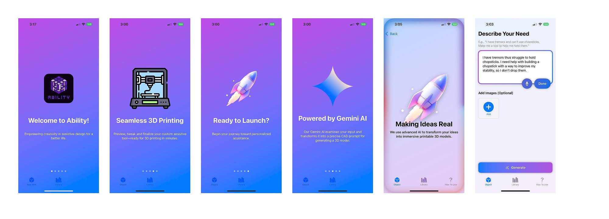
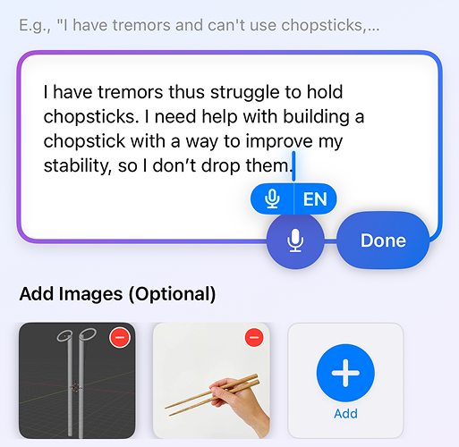

# Ability Project: 3D Model Generation from User Input

This project enables users to generate and refine 3D models through text and image inputs, using an interactive chat-based process. Designed with accessibility in mind, it empowers individuals—especially those with disabilities—to create custom, 3D-printable assistive devices and prosthetics tailored to their needs and help them complete everyday tasks.

Go watch Demo Video: https://www.youtube.com/watch?v=dQw4w9WgXcQ
Download: Not published yet



## Features
- 🤖 AI-powered 3D model generation from text descriptions
- 🖼️ Image-based model refinement and customization
- 💬 Interactive chat interface for iterative design
- 🎯 Accessibility-focused design
- 🖨️ 3D-printable output formats
- 🔄 Real-time model preview and adjustments
- 📱 Mobile-friendly interface
- 🌐 Cloud-based processing

## System Requirements
- iOS 15.0 or later
- iPhone with A12 Bionic chip or newer
- Active internet connection
- Blender (for local server setup)

## Installation

### iOS App
1. Download the app from the App Store (coming soon)
2. Launch the app and grant necessary permissions
3. Start creating your 3D models!

### Local Server Setup (for developers)
1. Clone the repository:
   ```bash
   git clone https://github.com/yourusername/Ability.git
   cd Ability
   ```
2. Install Blender from [blender.org](https://www.blender.org/download/)
3. Set up the Python environment:
   ```bash
   cd BPY2OBJ-main
   python3 -m venv .venv
   source .venv/bin/activate
   pip install -r requirements.txt
   ```
4. Start the server:
   ```bash
   python local_server.py
   ```

## How to Use
In the given Text box enter the 3D model you want to be built, see image below for an example



The following is a sample input to build a 3D model
*Optional* Add Images for better accuracy

## Usage Examples

### Basic Usage
1. Open the app
2. Enter a description of your desired 3D model
3. Add reference images (optional)
4. Review and adjust the generated model
5. Export in your preferred format

### Advanced Features
- Use natural language to describe modifications
- Upload reference images for precise customization
- Preview models in real-time
- Export in multiple formats (OBJ, STL, etc.)

## Contributing
We welcome contributions! Please see our [Contributing Guidelines](CONTRIBUTING.md) for details.

## License
This project is licensed under the MIT License - see the [LICENSE](LICENSE) file for details.

## Support
- Documentation: [Link to docs]
- Issues: [GitHub Issues](https://github.com/yourusername/Ability/issues)
- Community: [Discord/Forum link]

## Acknowledgments
- Blender Foundation for the 3D modeling engine
- OpenAI for language model capabilities
- Our amazing community of contributors and users

## Roadmap
- [ ] Enhanced AI model capabilities
- [ ] Additional export formats
- [ ] Cloud rendering support
- [ ] Collaborative features
- [ ] Advanced customization options

## Contact
- Email: [your-email@example.com]
- Twitter: [@yourhandle]
- Website: [your-website.com]

 
